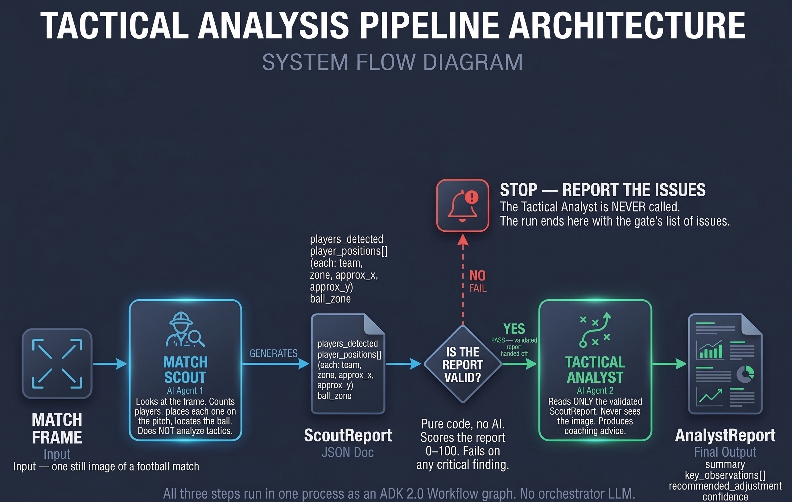

# Copa Chalkboard

A beginner Codelab: build a **two-agent tactical-analysis system** on Gemini +
[Google ADK](https://google.github.io/adk-docs/). A **Match Scout** looks at one
match frame and a **Tactical Analyst** turns its read into coaching advice — with
a **validation gate** guarding the handoff between them.

> The whole thing runs **in a single process** (one Colab notebook). No gateway,
> no Redis, no Cloud Run. The agent-to-agent handoff *is* the lesson.

## What you'll learn

1. A **multimodal agent** (the Scout) — exploring how reliably a vision model can emit structured JSON from match imagery (consistency testing showed 100% schema alignment on transition plays, though factual grounding remains unverified by syntax gates).
2. An **in-process handoff** — Scout, gate and Analyst wired as an ADK 2.0
   `Workflow` graph: the gate is a routing node, the Analyst only runs on `pass`.
3. A **validation gate** that refuses to pass a bad report downstream
   (the same idea as race-condition's LLM-as-Judge `planner_with_eval`).

## The flow



## Quickstart

```bash
# 1. Install (uv recommended)
make install            # or: pip install -e ".[dev,adk]"

# 2. Run the tests — no API key needed, fully offline
make test

# 3. Add your key (https://aistudio.google.com/apikey)
cp .env.example .env    # then edit .env  (it's gitignored)
export GEMINI_API_KEY=...          # or rely on .env

# 4. Run the two-agent pipeline on a match image
make run IMAGE=https://commons.wikimedia.org/wiki/Special:FilePath/Sulley_Muntari_(Ghana_national_football_team).jpg
#   or: python -m copa_chalkboard --image ./assets/frame.jpg
#   or the same flow as an ADK Workflow graph (needs the [adk] extra):
#       python -m copa_chalkboard --image ./assets/frame.jpg --adk
#   or in the ADK dev UI:  adk web .   (then pick copa_chalkboard)
```

## Layout

```
copa_chalkboard/
  schemas.py     # the typed contracts between agents (start here)
  scout.py       # Match Scout — vision -> ScoutReport (genai + ADK paths)
  gate.py        # validation gate — a PURE, tested function
  analyst.py     # Tactical Analyst — ScoutReport -> AnalystReport
  pipeline.py    # wiring: plain-Python orchestrator + ADK-native (Workflow graph)
  agent.py       # `adk web` entry point: root_agent = the Workflow
  __main__.py    # CLI: python -m copa_chalkboard --image ... [--adk]
tests/           # offline unit tests (TDD; no key, no network)
docs/adr/        # why the architecture is the way it is
experiments/scout-smoketest/   # is the vision step reliable enough? (delivery risk)
CONTEXT.md       # the ubiquitous language — read before contributing
CLAUDE.md        # ground rules for coding agents
```

## Two ways to see the handoff

- **`run_pipeline_local`** (`pipeline.py`) — plain, readable Python. The model
  steps are injected, so the flow is unit-tested with fakes. This is the
  "what's actually happening" view.
- **`make_adk_pipeline`** (`pipeline.py`) — the ADK-native version: an ADK 2.0
  `Workflow` graph, `START -> match_scout -> validation_gate --pass--> tactical_analyst`,
  with a `--fail-->` branch that stops. No orchestrator LLM; the gate is code that
  routes. `run_pipeline_adk` runs it and returns the same `PipelineResult`.
  Requires `pip install "copa-chalkboard[adk]"` (google-adk >= 2.9.0). Why a
  graph and not `AgentTool`: `docs/adr/0004`. What changed in ADK since the
  original pin: `docs/adk-release-review-2026-09.md`.

## Engineering practices

Adapted from [Matt Pocock's skills](https://github.com/mattpocock/skills):
a `CONTEXT.md` shared language, `docs/adr/` decision records, a green-by-default
TDD harness, deep modules with simple surfaces, and secrets via env only.

## License

Apache-2.0.
